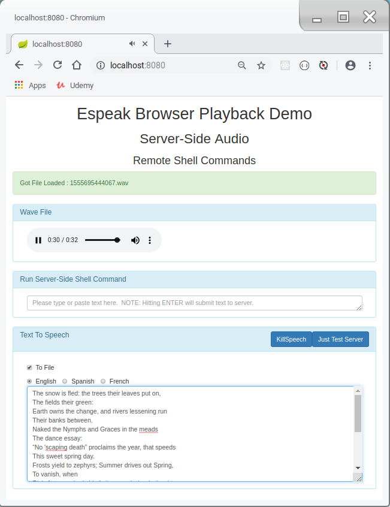
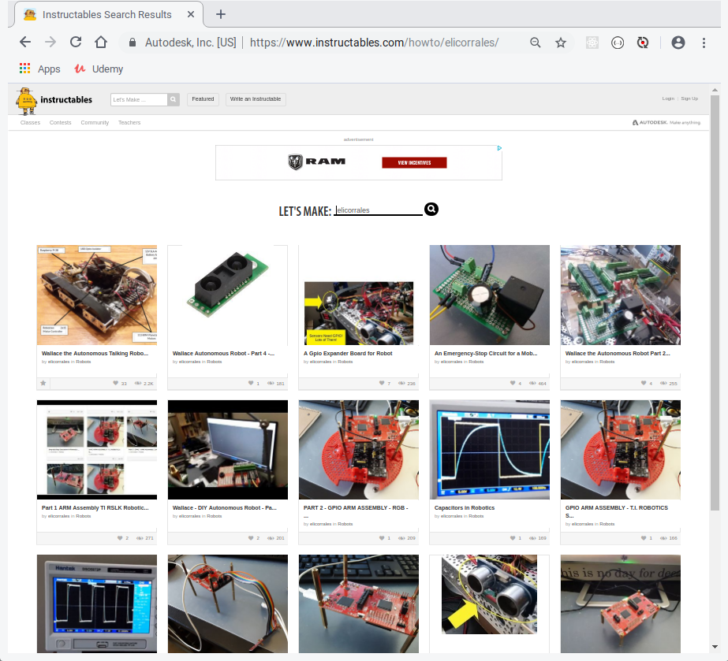

# Professional Resume'
https://github.com/elicorrales/links-to-projects-articles-videos-code/blob/master/The.Latest.Resume.pdf  
 

# Resume' - Robotics , IoT, Custom Automated Testing  
https://github.com/elicorrales/links-to-projects-articles-videos-code/blob/master/eli.corrales.robotics.resume.pdf  
 
 

# Blockchain Decentralized Applications (dApps) Tutorials  
https://github.com/elicorrales/blockchain-tutorials/blob/main/README.md  
 
 

# Rust and WASM Tutorials  
https://github.com/elicorrales/learning-rust-n-wasm-tutorials/blob/main/README.md  
 
 

# Control Multiple Cameras To Capture And Estimate Object Distance - First Attempt  
<a href="https://github.com/elicorrales/control-multi-camera-javascript-estimate-distance-1"><h3> The Project Code </h3></a>  
## (click image for demo video)  

# A.I. Machine Learning Flappy Bird Toy Neural Network Demo
<a href="https://github.com/elicorrales/Flappy.Bird.Neural.Network.Demo"><h3> The Project Code </h3></a>
## (click image for demo video)

# Color Classifier Using Tensorflow.js
<a href="https://github.com/elicorrales/tensorflow.js-color-classifier"><h3> The Project Code </h3></a>
## (click image for demo video)

# Polynomial Regression Using Tensorflow.js
<a href="https://github.com/elicorrales/tensorflow.js-polynomial-regression-demo"><h3> The Project Code </h3></a>
## (click image for demo video)

# Improved XOR Neural Network Training Demo
<a href="https://github.com/elicorrales/p5js-nature-of-code-neural-network-xor-example-improved"><h3> The Project Code </h3></a>
## (click image for demo video)

# Simple Perceptron App
<a href="https://github.com/elicorrales/SimplePerceptronApp"><h3> The Project Code </h3></a>
## (click image for demo video)

# Spring Boot REST Responsive Multi-File Upload
<a href="https://github.com/elicorrales/spring.boot.large.files.upload.download.show.progress"><h3> The Project Code </h3></a>
## (click image for demo video)

# Spring Boot REST Text-to-Speech
<a href="https://github.com/elicorrales/spring.boot.rest.angularjs.tts.server"><h3> The Project Code </h3></a>
## (click image for demo video)

# Spring Boot REST Salsa App
<a href="https://github.com/elicorrales/spring-boot-rest-salsa-app"><h3> The Project Code </h3></a>
## (click image for demo video)

# Articles On Robotics & Embedded Projects
## (click image)

